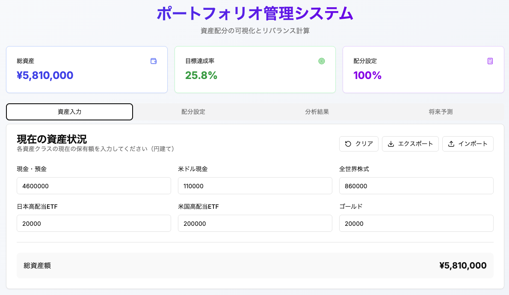
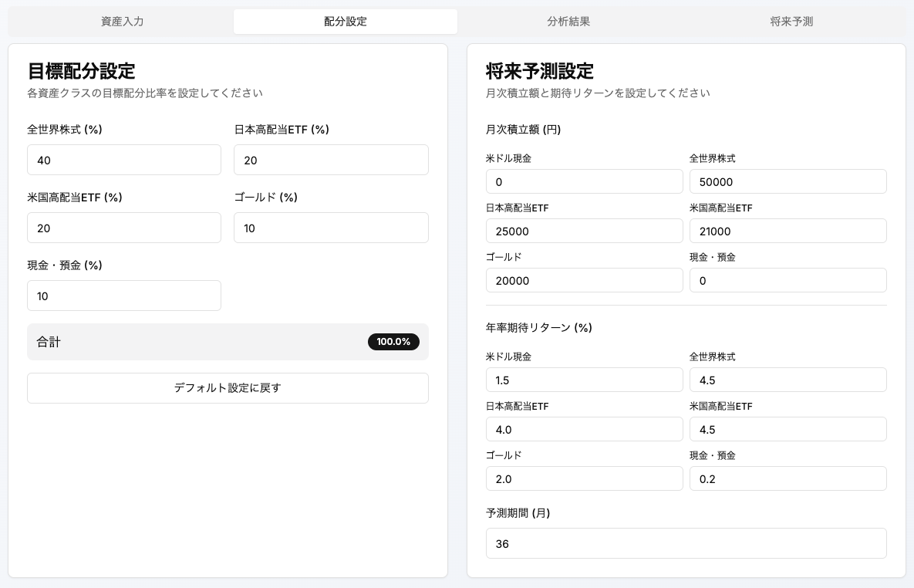
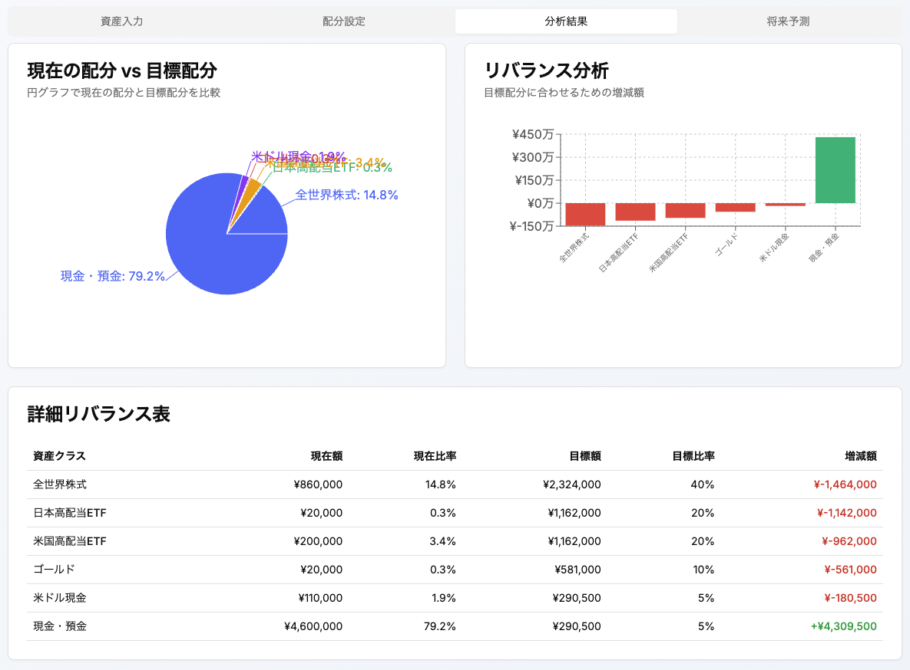
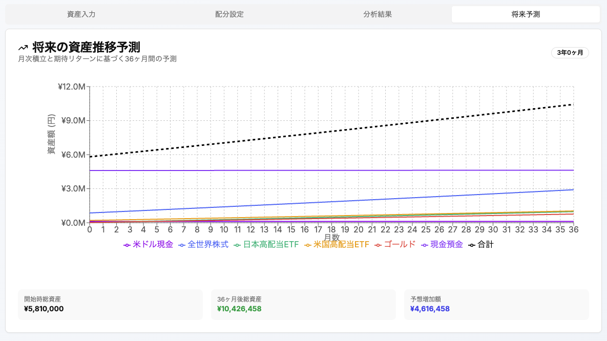

# ポートフォリオ管理システム

## 📊 概要

- 資産配分の可視化とリバランス計算を行うWebアプリケーションです。
- 現在の投資状況と目標配分を比較し、最適なポートフォリオ管理をサポートします。






## ✨ 主な機能

- **📈 資産配分の可視化**: 現在の保有資産を円グラフで表示
- **🎯 目標配分との比較**: 理想的な配分との差分をバーチャートで可視化
- **💰 リバランス計算**: 目標配分に合わせるために必要な増減額を自動計算
- **🔮 将来予測**: 月次積立額と期待リターンを基にした資産推移シミュレーション
- **📁 データ管理**: JSON形式でのインポート/エクスポート機能
- **💾 自動保存**: ブラウザのlocalStorageによる自動データ保存

## 🛠️ 技術スタック

### フロントエンド
- **Framework**: Next.js 14 (App Router)
- **Language**: TypeScript
- **UI**: React 18 + Tailwind CSS
- **Charts**: Recharts
- **State Management**: React Hooks (useState, useMemo)

### バックエンド
- **API**: Python FastAPI
- **CORS**: Cross-Origin Resource Sharing対応
- **計算エンジン**: 複利計算とポートフォリオ最適化

### データ管理
- **Storage**: Browser localStorage
- **Format**: JSON (インポート/エクスポート対応)
- **Validation**: フロントエンドでの入力値検証

## 🚀 セットアップ

### 前提条件
- Node.js 18.0 以上
- Python 3.8 以上
- npm または yarn

### フロントエンド
```bash
# リポジトリをクローン
git clone https://github.com/your-username/portfolio-management-system.git
cd portfolio-management-system

# 依存関係をインストール
npm install

# 開発サーバーを起動
npm run dev
```

### バックエンド（計算API）
```bash
# Pythonの仮想環境を作成
python -m venv venv

# 仮想環境を有効化
# Windows:
venv\Scripts\activate
# macOS/Linux:
source venv/bin/activate

# 依存関係をインストール
pip install fastapi uvicorn numpy pandas

# APIサーバーを起動
uvicorn main:app --reload --host 0.0.0.0 --port 8000
```

## 📱 使い方

### 1. 資産入力
現在の保有資産を各カテゴリ別に入力します：
- 現金・預金
- 米ドル現金
- 全世界株式
- 日本高配当ETF
- 米国高配当ETF
- ゴールド

### 2. 目標配分設定
理想的なポートフォリオの配分比率を設定します：
- 全世界株式: 40%
- 日本高配当ETF: 20%
- 米国高配当ETF: 20%
- ゴールド: 10%
- 現金・預金: 10%

### 3. 分析結果確認
- **現在配分vs目標配分**: 円グラフで視覚的に比較
- **リバランス分析**: 必要な調整額をバーチャートで表示
- **詳細表**: 各資産クラスの詳細な数値を表形式で確認

### 4. 将来予測（オプション）
- 月次積立額を設定
- 各資産の期待リターンを設定
- 予測期間を指定して将来の資産推移をシミュレーション

## 📊 スクリーンショット

### 資産入力画面
現在の保有資産を簡単に入力できるインターフェース

### ### 分析結果画面
目標配分率、月次積立額、将年率期待リターン率を設定

### 分析結果画面
現在配分と目標配分を視覚的に比較

### 将来予測画面
積立投資による資産の成長をシミュレーション

## 🎯 対象配分（デフォルト）

| 資産クラス | 目標配分 | 説明 |
|------------|----------|------|
| 全世界株式 | 40% | 分散投資によるリスク軽減 |
| 日本高配当ETF | 20% | 国内市場への投資 |
| 米国高配当ETF | 20% | 米国市場への投資 |
| ゴールド | 10% | インフレヘッジ |
| 現金・預金 | 10% | 流動性確保 |

## 🔧 カスタマイズ

### 目標配分の変更
`targetAllocation` オブジェクトを編集することで、独自の目標配分を設定できます。

### 新しい資産クラスの追加
1. 入力フォームにフィールドを追加
2. 計算ロジックに新しい資産を組み込み
3. グラフ表示に新しいカテゴリを追加

## 📈 計算ロジック

### リバランス計算
```
目標金額 = 総資産 × 目標配分比率
増減額 = 目標金額 - 現在金額
```

### 複利計算
```
将来価値 = 現在価値 × (1 + 年率リターン)^年数 + 積立額の将来価値
```

## 🤝 コントリビューション

1. このリポジトリをフォーク
2. 新しいブランチを作成 (`git checkout -b feature/amazing-feature`)
3. 変更をコミット (`git commit -m 'Add amazing feature'`)
4. ブランチをプッシュ (`git push origin feature/amazing-feature`)
5. Pull Requestを作成


## 🙏 謝辞

- [Next.js](https://nextjs.org/) - React フレームワーク
- [Tailwind CSS](https://tailwindcss.com/) - CSSフレームワーク
- [Recharts](https://recharts.org/) - データ可視化ライブラリ
- [FastAPI](https://fastapi.tiangolo.com/) - Python Webフレームワーク

---
